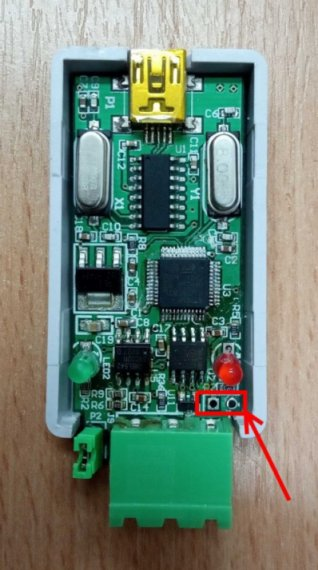

# usb-can-firmware-stm32
Firmware for stm32 used for USB-CAN transceiver. This program have some
limitation from original firmware, like it don't works with external eeprom,
that is on PCB. I'm not sure, how exactly is used this eeprom in original
program, maybe for storing CAN data in ofline mode?

## what made me write this firmware
My former colleague bought from aliexpress cheap usb-can adapter with version
on photo bellow. This photo is exactly piece of adapter, that he own. He lend
me for job purpose. I worked on it during implementing communication interface
in my program, that comunicated with mentioned adapter. During working with it,
adapter was stop working without any warnings. I didn't understand why, because
no hardware issuses occours. I tought about two possibilities. First case was
intensional bad original firmware, that will stops after few times and second
case was some unintentional random rewriting flash memory for static
discharge reason.

Cost of adapter is maybe about 12EU in better case, and components on it's board
is not so expensive. And morever main processor wasn't damaged. First time, I
searched on internet, if are availaible original or some other firmware for this
device, but I found nothing. On other hand I found peaple on forums with the
same problem, when adapter was stop working without any reason. My idea was
helping all consumers with this problem and avoid thorwing device to trash for
trivial problems that is possible solve litterly with zero expenses.

I give back converter to my former colleague. Just now I dont have this device
physicaly. Please don't want from me any changes in my code or testing some
functionalities. I tested my firmware at time, when device was availaible for
me and all my implementations works correctly.

Also I don't have any reason buy this device only for helping specific
consumers. My goal was achieved. Any addisional requirments must be self-solved
by user. My instruction and basic code would be enough for some peaple and if
not, it may be at least inspiration for firmware by whishes of user.

## what can doing my firmware
In my firmware is implemented these functionalities:
* sending/receiving can bus data
* sending/receiving data through uart
* flashing of LED by state of communication
* fixed speed uart communication 2Mbps
* adjustable speed of can bus communication with choises: 5kBps, 10kBps, 20kBps,
	50kBps, 100kBps, 125kBps, 200kBps, 250kBps, 400kBps, 500kBps, 800kBps, 1MBps

## different behavior from original firmware
In original testing program for this converter was implemented
	(with exept of my functionalities):
* adjustable speed of uart communictation (I don't know how it's possible,
	and I'm not absolutely sure, if it real worked. This choises maybe have only
	button on testing program)
* using i2c eeprom (I don't know, for what is used, maybe for filtering
	incomming can bus data)
* filtering incomming can bus packets by id
* any other functionalities which I don't konw about

## possible problems
On aliexpress is these converters with simillar desing with diffrent size. I
	don't know, if schematic is the same or with any changes. For example, if
	can bus is used on diffrent pins of processor with comparing with device
	used in this project, can bus will not work. After that is simple changing
	my firmware code to corect pins, recompile it and flashing again.

## necessary dependencies
	STM32CubeMX - for compiling of project
	Demonstrator GUI - for flashing of stm32 trough serial port

## downloading and compiling of project
```
git clone https://github.com/Kosmonova/usb-can-firmware-stm32
cd usb-can-firmware-stm32
make
```

## flashing of binary file into stm32 using ST-LINK programmer
```
st-flash write ./.pio/build/bluepill_f103c6/firmware.bin  0x08000000
```

## flashing of binary file into stm32 without programmer
Stm32 have build in bootloader for flashing through uart interface. The same
uart interface is used also for transceivering of CAN bus data trought USB. This
good behavior enables flashing of stm32 without any programmer.

For setting st32 into boot mode is needed these steps:
1) turn off USB cable from PC
2) connect pads together on this picture bellow and hold them



3) turn on USB cable into PC

Now is stm32 in boot mode and is waiting for flassing. For Flashing of stm
trough serial port is used program "Demonstrator GUI". This program is possible
free download from internet. Breafly description how is possible flashing of
stm is somewere on web sites.
